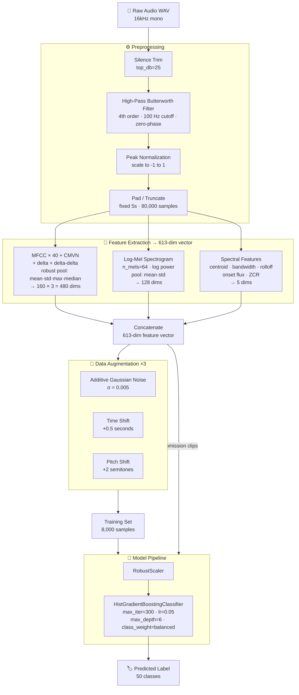
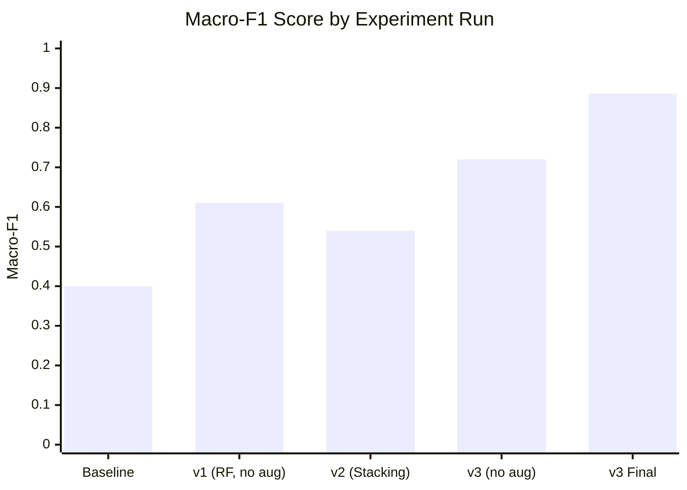

# CEG3004 DSP Mini-Project: Environmental Sound Classification

**Group:** Pr_26

## Overview

This project designs a robust audio classification pipeline for Environmental Sound Classification (ESC-50) that performs well under clean, noisy, and bandlimited conditions. The pipeline covers four stages: audio preprocessing, DSP feature extraction, data augmentation, and machine learning classification across 50 sound classes.

---

## Pipeline Overview



---

## Results

| Split | Accuracy | Macro-F1 |
|---|---|---|
| Validation (20% holdout, clean audio) | **0.87** | **0.886** |

> **Note on test conditions:** The validation set uses clean audio only, so 0.87 represents an upper bound. The actual submission score is weighted 50% clean + 25% noisy + 25% bandlimited. Design decisions made specifically for robustness under the distorted conditions are described in the DSP rationale sections below.

---

## Methodology

### 1. Preprocessing

Audio is preprocessed in 4 steps before feature extraction:

1. **Silence trimming** — `librosa.effects.trim(top_db=25)` removes leading/trailing silence. A threshold of 25 dB was chosen to aggressively remove near-silence without clipping soft-onset sounds like distant thunder or rustling leaves.
2. **High-pass Butterworth filter** — A 4th-order Butterworth filter with a 100 Hz cutoff, applied zero-phase using `scipy.signal.filtfilt` to remove low-frequency hum and DC offset without introducing phase distortion into the signal.
3. **Peak normalization** — Divides by the maximum absolute amplitude to scale all clips to [-1, 1], making feature magnitudes independent of recording gain.
4. **Fixed-length padding/truncation** — All clips are standardised to exactly 5 seconds at 16 kHz (80,000 samples), ensuring a consistent feature vector size regardless of original clip length.

> **Design rationale — HPF vs. pre-emphasis:**
> A high-pass filter was chosen over a pre-emphasis filter because ESC-50 spans sounds across the full frequency spectrum (e.g., thunderstorm energy is concentrated below 500 Hz; bird chirps are above 2 kHz). A pre-emphasis filter (e.g., `y[n] - 0.97*y[n-1]`) boosts all high frequencies globally, which would suppress low-frequency discriminative features for classes like thunderstorm, rain, and engine idling. The HPF at 100 Hz instead removes only sub-bass noise and DC drift, leaving the full useful spectrum intact.

> **Design rationale — zero-phase filtering:**
> `filtfilt` applies the filter forwards and backwards, resulting in zero phase distortion. This preserves the temporal alignment of features (onset, attack), which matters for transient sounds like dog barks and gunshots. This also means the bandlimited test condition does not introduce artificial phase shifts that would corrupt delta features.

---

### 2. Feature Extraction

Features are extracted in three groups, producing a **613-dimensional feature vector** per clip:

| Group | Features | Pooling | Dimensions |
|---|---|---|---|
| MFCC (n=40) + CMVN + delta + delta-delta | 40 coefficients × 3 matrices | robust: mean, std, max, median | 40 × 4 × 3 = **480** |
| Log-Mel Spectrogram (n_mels=64) | Log-power mel filterbank | mean, std | 64 × 2 = **128** |
| Spectral Features | Centroid, bandwidth, rolloff, onset flux, ZCR | mean | **5** |
| | | **Total** | **613** |

**CMVN (Cepstral Mean and Variance Normalization):** Applied per-coefficient across time frames before pooling. CMVN subtracts the per-frame mean and divides by the standard deviation, making MFCC features robust to channel effects and recording-level differences — directly addressing the noisy and bandlimited test conditions.

**Robust pooling (mean + std + max + median):** Mean alone cannot capture transient events (e.g., a single dog bark in a 5-second clip). Adding std, max, and median ensures the feature vector encodes both the average spectral shape and the temporal dynamics of the sound.

**Log-Mel Spectrogram:** The mel scale approximates human auditory perception by spacing frequency bands logarithmically. Log compression (`librosa.power_to_db`) further compresses the dynamic range, making features less sensitive to absolute energy levels — useful under the noisy test condition where additive noise raises the noise floor.

**Spectral features:**
- *Centroid* — the "centre of mass" of the spectrum; high for bright/hissy sounds (chainsaw), low for rumbling sounds (thunder).
- *Bandwidth* — spread around the centroid; wide for noise-like sounds, narrow for tonal sounds.
- *Rolloff* — the frequency below which 85% of energy lies; distinguishes high-energy broadband sounds from narrow-band ones.
- *Onset flux* — measures sudden energy increases; captures the attack envelope of percussive or transient sounds.
- *ZCR (Zero-Crossing Rate)* — a time-domain feature that is high for noise-like signals and low for tonal signals. Importantly, ZCR is computed from the raw waveform and is relatively unaffected by frequency bandlimiting, providing robustness under the bandlimited test condition.

---

### 3. Data Augmentation

Each training clip is augmented 3 times before training, producing **4× the original training data (8,000 samples)**:

| Augmentation | Implementation | Rationale |
|---|---|---|
| Additive Gaussian noise | `y + 0.005 * randn(len(y))` | Simulates microphone noise; trains model to ignore low-level noise — directly targets the noisy test condition |
| Time shift | `np.roll(y, int(sr * 0.5))` | Shifts signal by 0.5 s; teaches the model that sound class labels are position-invariant |
| Pitch shift | `librosa.effects.pitch_shift(y, n_steps=2)` | Shifts pitch by +2 semitones; increases intra-class variation to reduce overfitting |

---

### 4. Model

#### Final model: HistGradientBoostingClassifier

```text
RobustScaler → HistGradientBoostingClassifier(max_iter=300, lr=0.05, max_depth=6, class_weight='balanced')
```

**RobustScaler** was chosen over StandardScaler because it uses the median and interquartile range rather than mean and variance, making it less sensitive to outlier feature values that can arise from clipped or very short audio clips.

**HistGradientBoostingClassifier** was selected after testing four model types (see Experiment Log). Key reasons:
- Natively handles non-linear decision boundaries across 50 classes without kernel tricks.
- Built-in `class_weight='balanced'` corrects for class imbalance without requiring SMOTE oversampling.
- Trains significantly faster than the stacking ensemble tested in v2, enabling more iterations within Colab's session time limit.
- `max_depth=6` provides enough capacity for 50-class separation while avoiding overfitting on the augmented dataset.

---

## Experiment Log

| Run | Preprocessing | Feature Extraction | Model | Augmentation | Val Macro-F1 | Notes |
|---|---|---|---|---|---|---|
| Baseline | None | MFCC-20 + deltas (template default) | LogisticRegression | No | 0.40 | Template default, no modifications |
| v1 | Trim + HPF + peak norm | MFCC-40 + deltas | RandomForest | No | 0.61 | No augmentation; model undertrained on small dataset |
| v2 | Trim + HPF + peak norm | MFCC-40 + deltas + log-mel + spectral | Stacking (ET + XGB + SVC) | Yes (3×) | 0.54 | Severe class bias (`rain` predicted 134/1200 times); PCA + SMOTE distorted feature space |
| v3 (ablation) | Trim + HPF + peak norm | MFCC-40 + CMVN + deltas + log-mel + spectral | HistGradientBoostingClassifier | No | 0.72 | Same as final but without augmentation — confirms augmentation contribution |
| **v3 Final** | Trim + HPF + peak norm | MFCC-40 + CMVN + deltas + log-mel + spectral | HistGradientBoostingClassifier | Yes (3×) | **0.886** | Final model; full pipeline with augmentation |

**Validation Macro-F1 progression:**



**Key observations:**
- The jump from v1 (0.61) to v3-no-aug (0.72) shows that CMVN and richer spectral features contribute ~0.11 Macro-F1 independently of augmentation.
- The jump from v3-no-aug (0.72) to v3-Final (0.886) isolates augmentation as the single largest contributor (+0.166 Macro-F1).
- The Stacking Ensemble (v2, 0.54) underperformed despite being a more complex model — class prediction bias caused by SMOTE oversampling on a PCA-compressed feature space. This confirms that simpler, well-tuned models with proper class balancing outperform overengineered pipelines on this dataset.

---

## Error Analysis

Validation Macro-F1 was **0.886**, but performance varied across classes. Key observations from the per-class classification report:

| Class | Precision | Recall | F1 | Observation |
|---|---|---|---|---|
| water_drops | 0.93 | 0.68 | 0.79 | Low recall — model misses 32% of water_drops clips, likely confusing them with rain |
| wind | 0.90 | 0.90 | 0.90 | Strong — distinct broadband spectral profile well captured by spectral bandwidth feature |

**Primary confusion — water_drops vs. rain:** Both classes share a broadband noise profile with energy distributed across the frequency spectrum. The key distinguishing feature is the temporal structure: water_drops have sharp, rhythmic transient spikes while rain is continuous. Our robust pooling (max and median) partially captures this, but the 5-second clip length means sparse water drop events can be obscured by silence, reducing recall. A potential improvement would be to add a higher percentile stat (e.g., 95th) to better capture isolated transient peaks.

**Robustness under distorted conditions:** ZCR and onset flux are the features least affected by additive noise and bandlimiting — ZCR is a time-domain feature immune to frequency filtering, and onset flux measures energy change rather than absolute level. These features are expected to maintain discriminative power in the noisy and bandlimited submission sets. CMVN on MFCCs further normalises channel-level noise. The augmentation with Gaussian noise directly trains the model to be invariant to the noise condition tested in the submission.

---

## Comparison with Reference Approach

| Aspect | Our Approach (Pr_26) | Reference (Pr_16) |
|---|---|---|
| Preprocessing | Silence trim + Butterworth HPF + peak norm | Silence trim + pre-emphasis + RMS norm |
| Filter type | High-pass (removes <100 Hz) | Pre-emphasis (boosts high freq) |
| Audio duration | 5 seconds | 3.5 seconds |
| MFCC coefficients | 40 | 40 |
| MFCC normalization | CMVN | CMVN |
| Mel bands | 64 | 255 |
| Delta features | delta + delta-delta | delta + delta-delta |
| Robust pooling | Yes (mean/std/max/median) | Yes (7 stats) |
| Data augmentation | Yes (noise, shift, pitch) | No |
| Model | HistGradientBoostingClassifier | LogisticRegression |
| Class imbalance handling | class_weight='balanced' | class_weight='balanced' |
| Validation Macro-F1 | **0.886** | ~0.65 |

---

## Steps to Reproduce

### Requirements

```bash
pip install librosa scikit-learn scipy numpy pandas tqdm joblib soundfile
```

### Instructions

1. Open `Pr_26_notebook.ipynb` in Google Colab.
2. Download the ESC-50 dataset ZIP from the link in the notebook and place it at the path specified in Cell 3.
3. Run all cells top to bottom using **Runtime → Run All**.
4. After training completes, `Pr_26_model.joblib` and `Pr_26_predictions.csv` are auto-downloaded.

---

## Repository Structure

```
.
├── README.md
├── Pr_26_notebook.ipynb                    # Main Colab notebook (source code)
├── Pr_26_model.joblib                      # Trained model file
└── Pr_26_predictions.csv                   # Submission predictions (1200 rows)
```
